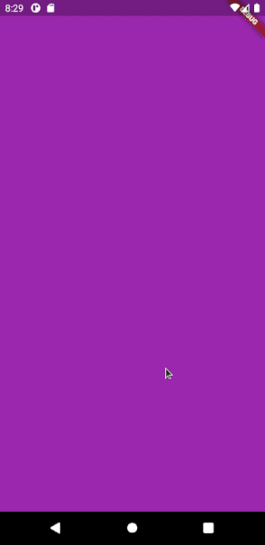

# Pulse

Pulse animation widget

## Getting Started

```dart
@override
Widget build(BuildContext context) {
  return Scaffold(
    body: Pulse(
      pulseColor: _colors.first,
      duration: Duration(seconds: 1),
      onComplete: () {
        print('Completed')
      },
    ),
  );
}
  ```


